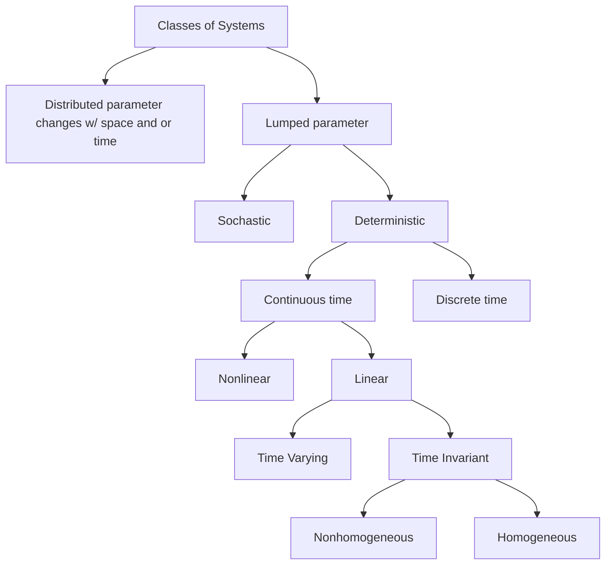

# How to Crush Dr.Sarangapani LCS

This repository will contain collaborative notes on how to do well in Dr.Kant's Mechanical and Aerospace Control System's class

The goal is to add student created notes on each module, homework, and overall concepts.

This is meant to extend and share the information amongst the students.

## Slide Overview

### Slide Deck 1: Introduction and Mathematical Modeling

**Terms**: Causality, Time Invariant, Time Varying, (Non)Homogeneous, Additivity, Superposition, Linear, zero-input response, zero-state response, lumped system , distributed system

A causal system is a system that is only a function of the current time and past time (time can be state). An acausal system is a function of current time, past time, and future times. Causal systems have proper transfer functions. 

A function/system is linear if it has the property of superposition. A system has the property of superposition if it is homogenous ($f(\alpha x)=\alpha f(x)$ and additive $f(x_1+x_2)=f(x_1)+f(x_2)$. NOTE: When looking at differential equations for linearity, we consider time a constant. 

**Skills**: Partial Fractions

**Concepts**: Classifying Systems, 

**Examples**: 

Systems can be classified as follows:

### Slide Deck 2: Linear Algebra

**Terms**: 

**Skills**: 

**Concepts**: 

**Examples**: 

### Slide Deck 3: Analysis of Continuous and Discrete-time Equations

**Terms**: 

**Skills**: 

**Concepts**: 

**Examples**: 
