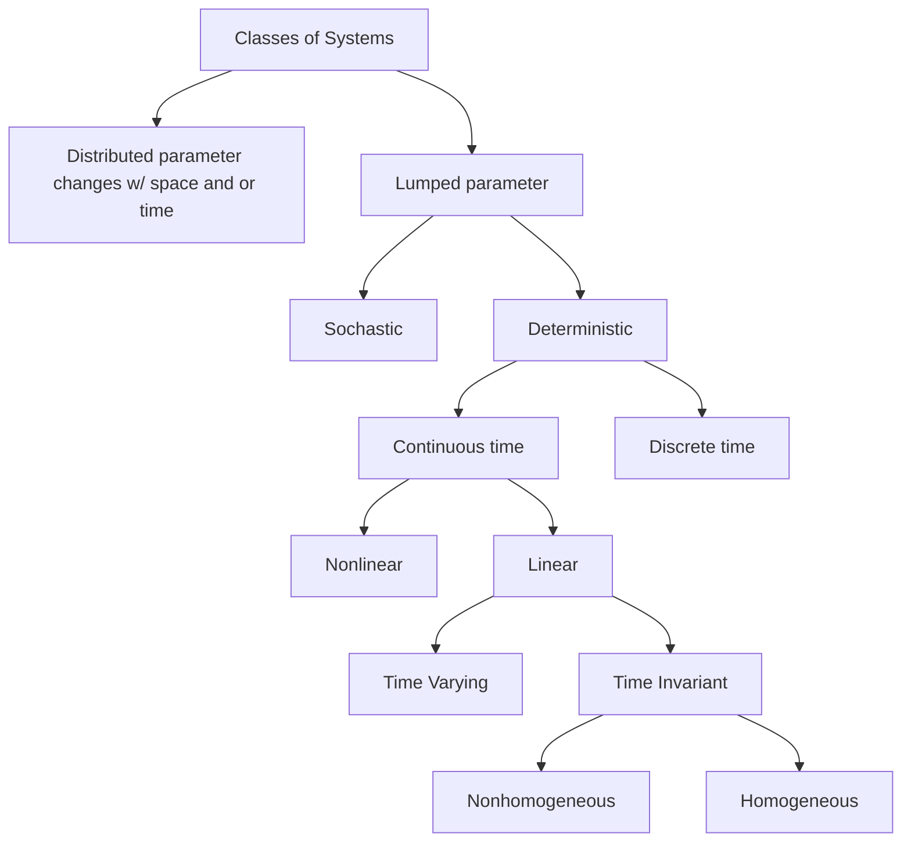

# Introduction and Mathematical Modeling

## Terms

State Variable, Causality, Time Invariant, Time Varying, (Non)Homogeneous, Additivity, Superposition, Linear, zero-input response, zero-state response, lumped system , distributed system, Lipschitz, Phase Variables, Proper, Strictly Proper, Biproper, Improper, Transfer-Matix Description of a System

**State Variable**: A state variable is a variable that if provided along with the input function can completely describe the system from that point in time and beyond.

**Causality**: A causal system is a system that is only a function of the current time and past time (time can be state). An acausal system is a function of current time, past time, and future times. Causal systems have proper transfer functions. 

**Time Variance**: A time invariant system is a system, that when represented in the state space takes the form, has constant A, B, C, and D matrices. If the A, B, C, and D matrices are functions of t, the system is said to be time varying.

**Linear**: A function/system is linear if it has the property of superposition.  
**Superposition**: A system has the property of superposition if it is **homogenous** ($f(\alpha x)=\alpha f(x)$ and **additive** $f(x_1+x_2)=f(x_1)+f(x_2)$. NOTE: When looking at differential equations for linearity, we consider time a constant.  

**Phase Variables**: For a SISO system, the states the logically fall out of the system, e.g. $x_1=y, x_2=\dot{y}, x_3=\ddot{y}, ...$ are sometimes referred to as phase variables.  

**Lumped and Distributed**: A lumped system is a system that is represented with a single value in time and space. A distributed system is one that varies infinitely with time, over a closed interval, and space. For example, a tank attached to an air compressor can be reasonably treated as a lumped system with all the mass, pressure, temperature, etc. represented as a single volume with the pressure and temperature. However, a hydraulic line with fluid moving has pressure and temperature varying at each point in space and is therefore a distributed system.

**Lipschitz**: The following is specifically in relation to state space modeling and differential equations. The Lipschitz condition states that for some function f(x), the lipschitz condition is met if $|f(x_1)-f(x_2)| \leq K |x_2 - x_1|$ where k is some constant value greater than 0. This condition is used to determine if some lumped-parameter, continuous time system is represented in state space form and we'd like to determine if a unique solution exists. If $\dot{x}=f(x,u,t)$ meets Lipschitz with respect to x, and f is continuous with respect to u, and f is piecewise continuous with respet to t, then a unique solution exists for any $t_o$.

## Skills

Derive differential equations for RLC circuits and Mass, Spring, Damper Systems
Create a state space model from a set of differential equations
Convert continuous system to a discrete system
Determine the transfer-matrix description of a system

## Concepts

Properties of state variables, Classifying Systems, Generic Block Diagrams for Discrete and Continuous state space models, Properties of linear systems

### Properties of State Variable

State variables are not unique but the number of state variables for a given system is.

The number of state variables is equal to the sum of the order of each equation. Example: A mass spring damper connected to a pendulum would typically have 4 state variables for the mass position and velocity and the pendulums position and velocity.

### Classifying Systems



### Generic Block Diagrams

Not going to recreate, see charts 20 and 21

### Properties of Linear Systems

Given a linear system and an initial condition and input function, we can determine the future of that system completely.

Linear systems have the properties of superposition, homogeneity, and additivity (see terms above).

Due to the properties of superposition, the response of a linear system can be represented as the sum of the response due to a zero state condition ($x(t_0)=0$) and the response due to a zero input condition ($u(t)=0$).  
$Response = zero-input response + zero-state response$

## Examples

Single Mass spring damper, RLC Circuit, Two Mass System

#### Continuous to Discrete

Given a continuous differential equation, we use forward difference method to determine the discrete system.

$\dot{x}(k) \approx \frac{x(k+1) - x(k)}{T}$

where, $T=t_{k+1} - t_k$ which is referred to as the sampling period. T is also $T=1/f_s$ where $f_s$ is the sampling frequency.

The following system can be converted to discrete:  
$\ddot{y}+4\dot{y}+y=u(t)$

$\dot{y}(k) \approx \frac{y(k+1) - y(k)}{T}$  
$\ddot{y}(k) \approx \frac{\dot{y}(k+1) - \dot{y}(k)}{T}$  
$\ddot{y}(k) \approx \frac{\frac{y(k+2) - y(k+1)}{T} - \frac{y(k+1) - y(k)}{T}}{T} = \frac{\frac{y(k+2) - y(k+1) - y(k+1) + y(k)}{T}}{T} = \frac{y(k+2) - 2y(k+1) + y(k)}{T^2}$  

Using the above relationships,  
$\ddot{y}+4\dot{y}+y=u(t)$

$\frac{y(k+2) - 2y(k+1) + y(k)}{T^2}+4(\frac{y(k+1) - y(k)}{T})+y(k)=u(k)$  
Divide by $T^2$,  
$y(k+2) - 2y(k+1) + y(k) + 4T(y(k+1) - y(k))+T^2y(k)=T^2u(k)$  
$y(k+2) - 2y(k+1) + y(k) + 4Ty(k+1) - 4Ty(k) + T^2y(k) = T^2u(k)$  
Group like terms,  
$y(k+2) + (4T-2) y(k+1) + (T^2 - 4T + 1) y(k) = T^2u(k)$  

$a_o = T^2 - 4T + 1$  
$a_1 = 4T-2$

```math
A = \begin{bmatrix} 0 & 1 \\ -a_o & -a_1 \end{bmatrix}
```

Note: the example does not represent canonical form completely since B is note [0 1]'.

#### Proper and Improper for Continuous and Discrete Systems

Given a transfer function $G(s) = \frac{Y(s)}{u(s)}$. Where $Y(s)$ and $u(s)$ is a polynomial, the following is true:  
The order of $Y(s)$ is N and order of $u(s)$ is D.

If $N \leq D$, the transfer function is proper
If $N > D$, the transfer function is strictly proper
If $N = D$, the transfer function is bipolar
If $N = D$, the transfer function is improper

The same logic holds for discrete systems in the Z-domain.

#### Transfer-Matrix Description

## To Do

- Consider some dynamic equations to add here specifically those for rotation.
