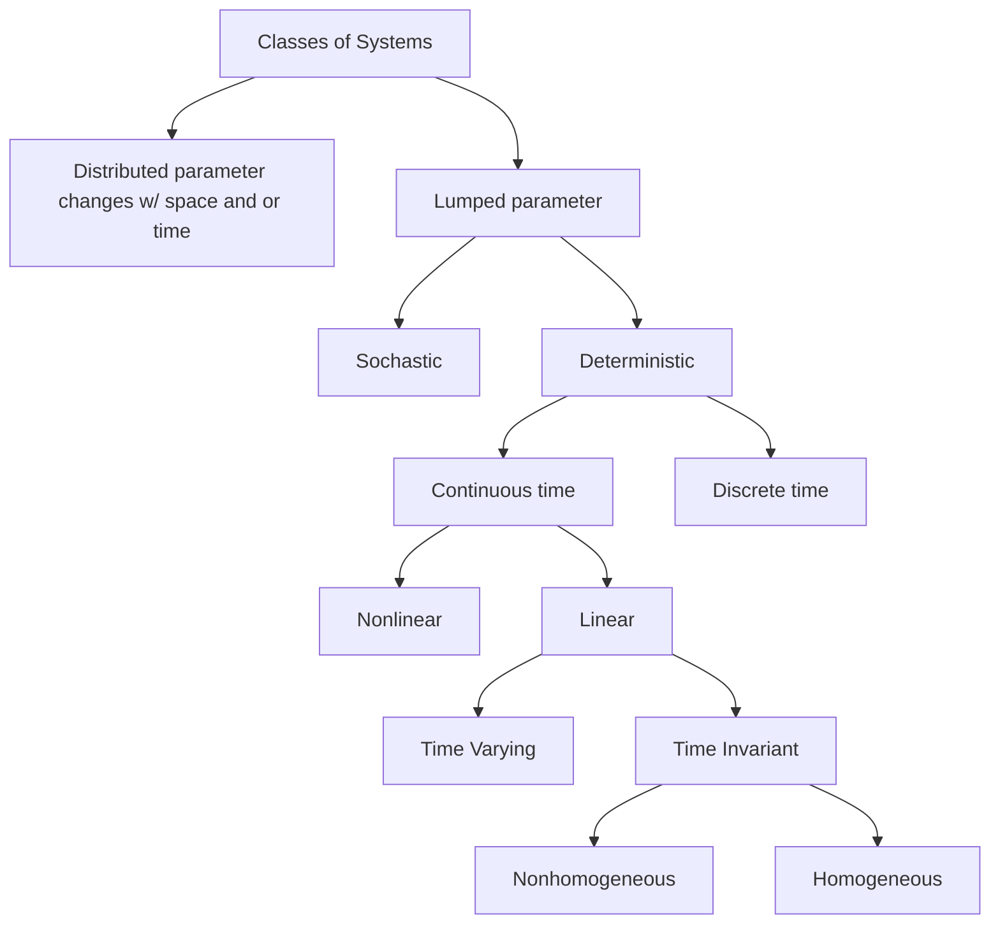

# Introduction and Mathematical Modeling

**Terms**: Causality, Time Invariant, Time Varying, (Non)Homogeneous, Additivity, Superposition, Linear, zero-input response, zero-state response, lumped system , distributed system, Lipschitz, Phase Variables, Proper, Strictly Proper, Biproper, Improper, Transfer-Matix Description of a System

Casual: A causal system is a system that is only a function of the current time and past time (time can be state). An acausal system is a function of current time, past time, and future times. Causal systems have proper transfer functions. 

Linear: A function/system is linear if it has the property of superposition.  
Superposition: A system has the property of superposition if it is **homogenous** ($f(\alpha x)=\alpha f(x)$ and **additive** $f(x_1+x_2)=f(x_1)+f(x_2)$. NOTE: When looking at differential equations for linearity, we consider time a constant.  

Phase Variables: For a SISO system, the states the logically fall out of the system, e.g. $x_1=y, x_2=\dot{y}, x_3=\ddot{y}, ...$ are sometimes referred to as phase variables.  

**Skills**: Derive differential equations for RLC circuits and Mass, Spring, Damper Systems, Convert continuous system to a discrete system, Determine the transfer-matrix description of a system

**Concepts**: Classifying Systems, Generic Block Diagrams for Discrete and Continuous state space models,

**Examples**: Single Mass spring damper, RLC Circuit, Two Mass System

Systems can be classified as follows:



#### Continuous to Discrete

Given a continuous differential equation, we use forward difference method to determine the discrete system.

$\dot{x}(k) \approx \frac{x(k+1) - x(k)}{T}$

where, $T=t_{k+1} - t_k$ which is referred to as the sampling period. T is also $T=1/f_s$ where $f_s$ is the sampling frequency.

The following system can be converted to discrete:  
$\ddot{y}+4\dot{y}+y=u(t)$

$\dot{y}(k) \approx \frac{y(k+1) - y(k)}{T}$  
$\ddot{y}(k) \approx \frac{\dot{y}(k+1) - \dot{y}(k)}{T}$  
$\ddot{y}(k) \approx \frac{\frac{y(k+2) - y(k+1)}{T} - \frac{y(k+1) - y(k)}{T}}{T} = \frac{\frac{y(k+2) - y(k+1) - y(k+1) + y(k)}{T}}{T} = \frac{y(k+2) - 2y(k+1) + y(k)}{T^2}$  

Using the above relationships,  
$\ddot{y}+4\dot{y}+y=u(t)$

$\frac{y(k+2) - 2y(k+1) + y(k)}{T^2}+4(\frac{y(k+1) - y(k)}{T})+y(k)=u(k)$  
Divide by $T^2$,  
$y(k+2) - 2y(k+1) + y(k) + 4T(y(k+1) - y(k))+T^2y(k)=T^2u(k)$  
$y(k+2) - 2y(k+1) + y(k) + 4Ty(k+1) - 4Ty(k) + T^2y(k) = T^2u(k)$  
Group like terms,  
$y(k+2) + (4T-2) y(k+1) + (T^2 - 4T + 1) y(k) = T^2u(k)$  

$a_o = T^2 - 4T + 1$  
$a_1 = 4T-2$

```math
A = \begin{bmatrix} 0 & 1 \\ -a_o & -a_1 \end{bmatrix}
```

Note: the example does not represent canonical form completely since B is note [0 1]'.

#### Proper and Improper for Continuous and Discrete Systems

Given a transfer function $G(s) = \frac{Y(s)}{u(s)}$. Where $Y(s)$ and $u(s)$ is a polynomial, the following is true:  
The order of $Y(s)$ is N and order of $u(s)$ is D.

If $N \leq D$, the transfer function is proper
If $N > D$, the transfer function is strictly proper
If $N = D$, the transfer function is bipolar
If $N = D$, the transfer function is improper

The same logic holds for discrete systems in the Z-domain.

#### Transfer-Matrix Description
